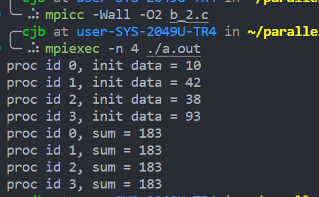

# 并行程序设计实验报告
**SA22011007 陈金宝**

## 代码、文件说明

文件结构：

```
├── lab1
│   ├── h1.c
│   ├── h2.c
│   ├── h3.c
│   ├── h4.c
│   ├── h5.c
│   └── lab1.h
├── lab2
│   ├── a.c
│   ├── b_2.c
│   ├── b.c
│   ├── c.c
│   ├── d.c
│   ├── e_2.c
│   ├── e.c
│   └── lab2.h
├── lab3
│   └── FFT.c
├── SA22011007_陈金宝_并行实验报告.pdf
```

lab1文件夹为OpenMP实验相关代码，h1到h5分别对应5个小题。lab2为MPI实验相关代码，a到e与MPI中相关题号对应，其中b_2为b的第二小问（二叉树方式求全和），e_2为e的第二小问（棋盘式划分）。lab3为个人实验相关代码。

实验代码已同步上传至个人github： https://github.com/wildoranges/parallel_lab

## 实验一-OpenMp

在OpenMp实验中，为了保证结果的正确性，会将OpenMP并行的结果与串行的结果相比较，一致则正确，不一致则错误。`lab1.h`中定义了一些辅助宏和函数来帮助进行比较。

```c
// lab1.h
#include <stdio.h>
#include <time.h>
#include <stdlib.h>
#include <omp.h>
#include <math.h>
#include <stdio.h>
#include <string.h>

#define min(x,y) ((x) < (y) ? x : y)
#define max(x,y) ((x) > (y) ? x : y)
#define memeq(x,y) (memcmp(x, y, sizeof(x)) == 0)
#define test(a) {if (a()) printf("%s test success\n", (#a)); else printf("%s test fail\n", (#a));}
```

### 一

`h1.c`中main函数如下所示，会对每个可并行循环进行测试，判断结果是否正确。

```c
int main() {
    omp_set_num_threads(16);
    test(loop1);
    test(loop2);
    test(loop3);
    return 0;
}
```

#### 循环1

对于循环1，行间有依赖，但是每行内是独立无依赖的，因此可以按照如下方式并行：

```c
int loop1() {
    float A[12][12];
    float B[12][12];

    memcpy(B, A, sizeof(A));

    for(int i = 2; i <= 10; i++) {
        #pragma omp parallel for num_threads(9)
        for (int j = 2; j <= 10; j++) {
            A[i][j] = 0.5 * (A[i-1][j-1] + A[i+1][j+1]);
        }
    }

    for(int i = 2; i <= 10; i++) {
        for (int j = 2; j <= 10; j++) {
            B[i][j] = 0.5 * (B[i-1][j-1] + B[i+1][j+1]);
        }
    }

    return memeq(A, B);
}
```

#### 循环2

对于循环2，数组A中下标为奇数的元素与下标为偶数的元素互不依赖，因此可以按照如下方式并行：

```c
int loop2() {
    int A[43];
    int B[21];
    int AA[43];
    memcpy(AA, A, sizeof(A));

    for(int i = 2; i <= 20; i++) {
        int k = min(i+1, 20);
        #pragma omp parallel for
        for (int j = i; j <= k; j++) {
            A[2*j+2] = A[2*j-2] + B[j];
        }
    }

    for(int i = 2; i <= 20; i++) {
        AA[2*i+2] = AA[2*i-2] + B[i];
    }

    return memeq(A, AA);
}
```

#### 循环3

对于循环3，可将A[i]大于0或小于等于0的情况分开并行，避免依赖。可以按照如下方式并行：

```c
int loop3() {
    int A[21];
    int B[21];
    int C[21];
    int BB[21];
    int CC[21];
    memcpy(CC, C, sizeof(C));
    memcpy(BB, B, sizeof(B));

    #pragma omp parallel for num_threads(19)
    for (int i = 2; i <= 20; i++) {
        if (A[i] <= 0) {
            C[i] = B[i] - 1;
        }
    }

    #pragma omp parallel for num_threads(19)
    for (int i = 2; i <= 20; i++) {
        if (A[i] > 0) {
            B[i] = C[i-1] + 1;
        }
    }

    for (int i = 2; i <= 20; i++) {
        if (A[i] > 0) {
            BB[i] = CC[i-1] + 1;
        } else {
            CC[i] = BB[i] - 1;
        }
    }

    return memeq(B, BB) && memeq(C, CC);
}
```

### 二

`h2.c`中main函数如下所示，会对每个可并行循环进行测试，判断结果是否正确。

```c
int main() {
    omp_set_num_threads(16);
    test(loop1);
    test(loop2);
    return 0;
}
```

#### 循环1

循环1行内无依赖，因此可按如下方式并行：

```c
int loop1() {
    const int M = 20;
    const int N = 20;
    const int C = 1;

    int A[M+2][N+2];
    int AA[M+2][N+2];
    memcpy(AA, A, sizeof(A));

    for (int i = 1; i <= M; i++) {
        #pragma omp parallel for num_threads(N)
        for (int j = 1; j <= N; j++) {
            A[i+1][j+1] = A[i][j] + C;
        }
    }

    for (int i = 1; i <= M; i++) {
        for (int j = 1; j <= N; j++) {
            AA[i+1][j+1] = AA[i][j] + C;
        }
    }

    return memeq(A, AA);
}
```

#### 循环2
i, j, k循环行内均无依赖，均可并行。如下所示：

```c
int loop2() {
    const int N = 20;
    int X[102];
    int Y[102];
    int A[102][102];
    int B[102];
    int C[102][102];

    int XX[102];
    int YY[102];
    int AA[102][102];
    int BB[102];

    memcpy(XX, X, sizeof(X));
    memcpy(YY, Y, sizeof(Y));
    memcpy(AA, A, sizeof(A));
    memcpy(BB, B, sizeof(B));

    #pragma omp parallel for
    for (int i = 1; i <= 100; i++) {
        X[i] = Y[i] + 10;
        #pragma omp parallel for 
        for (int j = 1; j <= 100; j++) {
            B[j] = A[j][N];
            #pragma omp parallel for 
            for (int k = 1; k <= 100; k++) {
                A[j+1][k] = B[j] + C[j][k];
            }
            Y[i+j] = A[j+1][N];
        }
    }

    for (int i = 1; i <= 100; i++) {
        XX[i] = YY[i] + 10;
        for (int j = 1; j <= 100; j++) {
            BB[j] = AA[j][N];
            for (int k = 1; k <= 100; k++) {
                AA[j+1][k] = BB[j] + C[j][k];
            }
            YY[i+j] = AA[j+1][N];
        }
    }
    
    return memeq(X, XX) && memeq(Y, YY) && memeq(A, AA) && memeq(B, BB);
}
```

### 三

`h3.c`中main函数如下所示，会对每个可并行循环进行测试，判断结果是否正确。

```c
int main() {
    omp_set_num_threads(16);
    test(loop1);
    test(loop2);
    return 0;
}
```

#### 循环1

循环1存在方向向量为(1,1) 和(0,1) 的依赖。本题无法使用OpenMP进行并行。

```c
int loop1() {
    //不能并行
    printf("loop1 cannot be parallelized\n");
    return 1;
}
```

#### 循环2

从循坏2可以分析得到其中A[i]依赖于C[i-1]，且除了C中的最后一个元素外，C
中其他元素只依赖于B中的元素。因此可以将C的更新提出来，单独使用一个循环并行。如下所示

```c
int loop2() {
    int y;
    int x = y * 2;
    int z;
    int A[102];
    int B[102];
    int C[102];
    int D[102][51];

    int AA[102];
    int CC[102];
    int DD[102][51];

    memcpy(AA, A, sizeof(A));
    memcpy(CC, C, sizeof(C));
    memcpy(DD, D, sizeof(D));

    #pragma omp parallel for
    for (int i = 1; i <= 100; i++) {
        C[i] = B[i] + x;
    }
    
    #pragma omp parallel for
    for (int i = 1; i <= 100; i++) {
        A[i] = C[i-1] + z;
        for (int j = 1; j <= 50; j++) {
            D[i][j] = D[i][j-1] + x;
        }
    }
    C[101] = A[100] * B[100];

    for (int i = 1; i <= 100; i++) {
        CC[i] = B[i] + x;
        AA[i] = CC[i-1] + z;
        CC[i+1] = AA[i] * B[i];
        for (int j = 1; j <= 50; j++) {
            DD[i][j] = DD[i][j-1] + x;
        }
    }
    z = y + 4;

    return memeq(A, AA) && memeq(C, CC) && memeq(D, DD);
}
```

### 四

`h4.c`中main函数如下所示，会对每个可并行循环进行测试，判断结果是否正确。

```c
int main() {
    omp_set_num_threads(16);
    test(loop1);
    test(loop2);
    test(loop3);
    return 0;
}
```

#### 循环1

分析循环1可得A[i][j]依赖于A[i][j-1]和A[i-1][j]，但对角之间无依赖。因此循环1可以按照斜对角线进行并行（从右上到坐下），代码如下所示

```c
int loop1() {
    float A[11][11];
    float AA[11][11];

    memcpy(AA, A, sizeof(A));

    for (int i = 3; i <= 19; i++) {
        int x = (i+1) / 2;
        #pragma omp parallel for
        for (int j  = max(2, i-9); j <= x; j++) {
            A[j][i+1-j] = (A[j][i-j] + A[j-1][i+1-j]) * 0.5;
        }
    }

    for (int i = 2; i <= 10; i++) {
        for (int j = i; j <= 10; j++) {
            AA[i][j] = (AA[i][j-1] + AA[i-1][j]) * 0.5;
        }
    }

    return memeq(A, AA);
}
```

#### 循环2

分析循环2可得，每相邻的三个元素之间互不依赖（A[i]、A[i+1]、A[i+2]），因此可以三个元素为一组进行并行，代码如下所示：

```c
int loop2() {
    int A[20];
    int B[20];
    int AA[20];

    memcpy(AA, A, sizeof(A));

    for (int i = 1; i <= 16; i += 3) {
        int minj = min(i+2, 16);
        #pragma omp parallel for
        for (int j = i; j <= minj; j++) {
            A[j+3] = A[j] + B[j];
        }
    }

    for (int i = 1; i <= 16; i++) {
        AA[i+3] = AA[i] + B[i];
    }

    return memeq(A, AA);
}
```

#### 循环3

与循环2相同

```c
int loop3() {
    int A[20];
    int B[20];
    int AA[20];

    memcpy(AA, A, sizeof(A));

    for (int i = 1; i <= 16; i += 3) {
        int minj = min(i+2, 16);
        #pragma omp parallel for
        for (int j = i; j <= minj; j++) {
            A[j+3] = A[j] + B[j];
        }
    }

    for (int k = 1; k <= 16; k+=5) {
        for (int i = k; i <= min(16, k+4); i++) {
            AA[i+3] = AA[i] + B[i];
        }
    } 

    return memeq(A, AA);
}
```

### 五

`h5.c`中main函数如下所示，会对每个可并行循环进行测试，判断结果是否正确。

```c
int main() {
    omp_set_num_threads(16);
    test(loop1);
    test(loop2);
    test(loop3);
    return 0;
}
```

#### 循环1

分析循环1可得数组A依赖与B，D依赖于C。因此可以将B、C和A、D计算分开。分开后A、D依赖的B、C已经计算好，A、D可以并行。B依赖上次计算的C，B、C之间无法并行。代码如下所示：

```c
int loop1() {
    float A[101];
    float B[101];
    float C[101];
    float D[101];
    float AA[101];
    float BB[101];
    float CC[101];
    float DD[101];

    memcpy(AA, A, sizeof(A));
    memcpy(BB, B, sizeof(B));
    memcpy(CC, C, sizeof(C));
    memcpy(DD, D, sizeof(D));

    for (int i = 1; i <= 100; i++) {
        B[i] = C[i-1] * 2;
        C[i] = 1 / B[i];
    }

    #pragma omp parallel for
    for (int i = 1; i <= 100; i++) {
        A[i] = A[i] + B[i-1];
        D[i] = C[i] * C[i];
    }

    for (int i = 1; i <= 100; i++) {
        AA[i] = AA[i] + BB[i-1];
        BB[i] = CC[i-1] * 2;
        CC[i] = 1 / BB[i];
        DD[i] = CC[i] * CC[i];
    }
    
    return memeq(A, AA) && memeq(B, BB) && memeq(C, CC) && memeq(D, DD);
}
```

#### 循环2

分析循环2可得，A的后半部分(501-999)依赖于前半部分(1-500)。后半与前半内无依赖。因此可将A的后半和前半分开并行，如下所示：

```c
int loop2() {
    int A[1001];
    int B[1001];
    int C[1001];
    int D[1001];
    int AA[1001];
    int DD[1001];

    memcpy(AA, A, sizeof(A));
    memcpy(DD, D, sizeof(D));

    #pragma omp parallel for
    for (int i = 1; i <= 500; i++) {
        A[i] = B[i] + C[i];
        D[i] = (A[i] + A[1000-i]) / 2;
    }
    #pragma omp parallel for
    for (int i = 501; i <= 999; i++) {
        A[i] = B[i] + C[i];
        D[i] = (A[i] + A[1000-i]) / 2;
    }

    for (int i = 1; i <= 999; i++) {
        AA[i] = B[i] + C[i];
        DD[i] = (AA[i] + AA[1000-i]) / 2;
    }

    return memeq(A, AA) && memeq(D, DD);
}
```

#### 循环3

分析依赖关系可知该循环无依赖，内层外层均可并行。代码如下所示

```c
int loop3() {
    int A[501][201];
    int C[101][101];
    int D[101][101];
    int AA[501][201];
    int DD[101][101];

    memcpy(AA, A, sizeof(A));
    memcpy(DD, D, sizeof(D));

    #pragma omp parallel for
    for (int i = 1; i <= 100; i++) {
        #pragma omp parallel for
        for (int j = 1; j <= 100; j++) {
            A[3*i+2*j][2*j] = C[i][j] * 2;
            D[i][j] = A[i-j+99][i+j];
        }
    }

    for (int i = 1; i <= 100; i++) {
        for (int j = 1; j <= 100; j++) {
            AA[3*i+2*j][2*j] = C[i][j] * 2;
            DD[i][j] = AA[i-j+99][i+j];
        }
    }

    return memeq(A, AA) && memeq(D, DD);
}
```

## 实验二-MPI

MPI实验采用OpenMPI。实验在本地完成，本地环境为：

```
OpenMPI：
libopenmpi-dev/xenial,now 1.10.2-8ubuntu1 amd64
openmpi-bin/xenial,now 1.10.2-8ubuntu1 amd64
openmpi-common/xenial,xenial,now 1.10.2-8ubuntu1 all
openmpi-doc/xenial,xenial,now 1.10.2-8ubuntu1 all

GCC：
gcc (Ubuntu 9.4.0-1ubuntu1~16.04) 9.4.0

OS：
Linux user-SYS-2049U-TR4 4.15.0-159-generic #167~16.04.1-Ubuntu SMP Wed Sep 22 14:59:34 UTC 2021 x86_64 x86_64 x86_64 GNU/Linux

CPU:
Intel(R) Xeon(R) Gold 6130 CPU @ 2.10GHz
```

`lab2.h`中定义了一些矩阵的辅助函数，主要是初始化和打印矩阵：

```c
// lab2.h
#include <mpi/mpi.h>
#include <stdio.h>
#include <stdlib.h>
#include <string.h>
#include <math.h>
#include <time.h>
#include <assert.h>

#define ID(i, j, n) ((i) * (n) + (j)) 

void rand_mat(int *mat, int n) {
    srand(clock());
    for (int i = 0; i < n; i++) {
        for (int j = 0; j < n; j++) {
            mat[ID(i, j, n)] = rand() % 10;
        }
    }
}

void print_mat(int *mat, int n) {
    for (int i = 0; i < n; i++) {
        for (int j = 0; j < n; j++) {
            printf("%d\t", mat[ID(i, j, n)]);
        }
        printf("\n");
    }
}

int mat_eq(int *mat1, int *mat2, int n) {
    return memcmp(mat1, mat2, sizeof(int) * n * n) == 0;
}

void rand_mat_double(double *mat, int n) {
    srand(clock());
    for (int i = 0; i < n; i++) {
        for (int j = 0; j < n; j++) {
            mat[ID(i, j, n)] = rand() % 10;
        }
    }
}

void print_mat_double(double *mat, int n) {
    for (int i = 0; i < n; i++) {
        for (int j = 0; j < n; j++) {
            printf("%lf\t", mat[ID(i, j, n)]);
        }
        printf("\n");
    }
}
```

### a

原先进程号模上组数可得在组内的新进程号。各组的root（0号进程）收到总root的消息后使用MPI_Bcast将消息广播。主要代码如下所示，默认组数为3。

```c
MPI_Init(&argc, &argv);
MPI_Comm_size(MPI_COMM_WORLD, &num_procs);
MPI_Comm_rank(MPI_COMM_WORLD, &id);
MPI_Comm split_world;
MPI_Status status;
int rank;
int size;
// split
MPI_Comm_split(MPI_COMM_WORLD, id % 3, id / 3, &split_world);
MPI_Comm_rank(split_world, &rank);
MPI_Comm_size(split_world, &size);

if (id == 0) {
    strcpy(recv_buf, msg);
    for (int i = 1; i < 3; i++) {
        MPI_Send(&msg, sizeof(msg), MPI_CHAR, i, tag, MPI_COMM_WORLD);
    }   
} else if (id > 0 && id < 3) {
    MPI_Recv(&recv_buf, BUF_SIZE, MPI_CHAR, 0, tag, MPI_COMM_WORLD, &status);
}

MPI_Bcast(&recv_buf, BUF_SIZE, MPI_CHAR, 0, split_world);
printf("proc rank %d, old rank %d, group size %d. received msg: %s\n", rank, id, size, recv_buf);
```

编译命令以及最后的运行结果如图所示：


### b

#### 蝶式
蝶式求和：在第i次迭代时，将进程号只有第i位不同的两个进程分别作为对方的目标进程，发送数据并求和。经过logN 次迭代之后，所有进程都会持有相同的累加和。在实现中，确定目标和源可以用异或操作实现。主要代码如下所示：

```c
srand(clock());
int sum = rand() % 100;
int recv_data;
MPI_Status status;
int layer = 1;
printf("proc id %d, init data = %d\n", id, sum);

for(int i = 1; i < num_procs; i = i << 1) {
    int dest = id ^ i;
    MPI_Send(&sum, 1, MPI_INT, dest, i, MPI_COMM_WORLD);
    MPI_Recv(&recv_data, 1, MPI_INT, dest, i, MPI_COMM_WORLD, &status);
    sum += recv_data;
    printf("layer %d, proc id %d, recv %d from proc %d, sum = %d\n", layer++, id, recv_data, dest, sum);
}
MPI_Barrier(MPI_COMM_WORLD);
printf("proc id %d, sum = %d\n", id, sum);
```

编译命令以及最后的运行结果如图所示：


#### 二叉树

求和时由下自上汇聚值，最终0号进程得到全和。在第i论迭代时所有进程号为$2^i$的倍数且第i为1的进程将自身持有的部分和发送给只有第i位不同的进程。

当0号进程得到全和后，按照上述过程的逆过程将全和反向广播给所有其他的节点。

主要代码如下所示

```c
srand(clock());
int sum = rand() % 100;
int recv_data;
MPI_Status status;
printf("proc id %d, init data = %d\n", id, sum);

for (int i = 1; i < num_procs; i = i << 1) {
    if (id & i) {
        MPI_Send(&sum, 1, MPI_INT, id - i, i, MPI_COMM_WORLD);
    } else {
        MPI_Recv(&recv_data, 1, MPI_INT, id + i, i, MPI_COMM_WORLD, &status);
        sum += recv_data;
    }
}

for (int i = num_procs; i >= 2; i >>= 1) {
    if (id % i == 0) {
        MPI_Send(&sum, 1, MPI_INT, id + (i >> 1), i, MPI_COMM_WORLD);
    } else if(id % (i >> 1) == 0) {
        MPI_Recv(&sum, 1, MPI_INT, id - (i >> 1), i, MPI_COMM_WORLD, &status);
    }
}
MPI_Barrier(MPI_COMM_WORLD);
printf("proc id %d, sum = %d\n", id, sum);
```

编译命令以及最后的运行结果如图所示：



### c

本题程序接收一个参数作为矩阵大小，且处理器数量需是完全平方数。

FOX算法将矩阵分块计算。为了更方便的表示子矩阵，可以使用MPI_Type_vector来声明一个vector类型的数据来表示子矩阵。同时根据子矩阵的的存储方式不同（在原先矩阵中存储、连续存储），子矩阵可有如下两种类型。

```c
MPI_Datatype submat;
MPI_Type_vector(submat_size, submat_size, mat_size, MPI_INT, &submat);
MPI_Type_commit(&submat);

MPI_Datatype mat;
MPI_Type_vector(submat_size, submat_size, submat_size, MPI_INT, &mat);
MPI_Type_commit(&mat);
```

0号进程在一开始时完成数据初始化以及数据的分发：

```c
if (id == 0) {
    MATA = (int *)malloc(sizeof(int) * (mat_size * mat_size));
    rand_mat(MATA, mat_size);
    MATB = (int *)malloc(sizeof(int) * (mat_size * mat_size));
    rand_mat(MATB, mat_size);
    MATC = (int *)malloc(sizeof(int) * (mat_size * mat_size));

    printf("mat A: \n");
    print_mat(MATA, mat_size);
    printf("mat B: \n");
    print_mat(MATB, mat_size);
}
...
if (id == 0) {
    for (int i = 0; i < p; i++) {
        for (int j = 0; j < p; j++) {
            int offset = i * mat_size * submat_size + j * submat_size;
            MPI_Isend(MATA+offset, 1, submat, i * p + j, 0, MPI_COMM_WORLD, &req);
            MPI_Isend(MATB+offset, 1, submat, i * p + j, 1, MPI_COMM_WORLD, &req);
        }  
    }
}

MPI_Barrier(MPI_COMM_WORLD);
MPI_Recv(submatA, 1, mat, 0, 0, MPI_COMM_WORLD, &status);
MPI_Recv(submatB, 1, mat, 0, 1, MPI_COMM_WORLD, &status);
...
```

将进程号按行、列进行划分

```c
MPI_Comm row_comm, col_comm;
int rank_i, rank_j;
int size_i, size_j;

MPI_Comm_split(MPI_COMM_WORLD, id / p, id % p, &row_comm);
MPI_Comm_rank(row_comm, &rank_i);
MPI_Comm_size(row_comm, &size_i);
assert(size_i == p && "size_i is not equal to p");
    
MPI_Comm_split(MPI_COMM_WORLD, id % p, id / p, &col_comm);
MPI_Comm_rank(col_comm, &rank_j);
MPI_Comm_size(col_comm, &size_j);
assert(size_j == p && "size_j is not equal to p");
```

在第m次迭代时，每一行选择特定的进程(第n行选择第n+m个进程)，在行内广播它持有的子矩阵A，进行子矩阵上的矩阵乘法（乘加）。每个进程将自身持有的子矩阵B发送给同一列中的上一个进程，作为下一次迭代的B。

```c
for (int iter = 0; iter < p; iter++) {
    if (rank_i == (rank_j + iter) % size_i) {
        memcpy(buf, submatA, sizeof(int) * (submat_size * submat_size));
    }

    MPI_Bcast(buf, 1, mat, (rank_j + iter) % size_i,row_comm);
    mat_mul_add(buf, submatB, submatC, submat_size);

    MPI_Send(submatB, 1, mat, (rank_j - 1 + size_j) %size_j, 0, col_comm);
    MPI_Recv(buf, 1, mat, (rank_j + 1) % size_j, 0,col_comm, &status);
    memcpy(submatB, buf, sizeof(int) * (submat_size *submat_size));
}
```

迭代完成后，由0号进程汇总结果，并检查结果是否正确。

```c
for (int i = 0; i < p; i++) {
    for (int j = 0; j < p; j++) {
        if (rank_j == i && rank_i == j) {
            MPI_Isend(submatC, 1, mat, 0, 2, MPI_COMM_WORLD, &req);
        }
        if (id == 0) {
            int offset = i * mat_size * submat_size + j * submat_size;
            MPI_Recv(MATC+offset, 1, submat, i * p + j, 2, MPI_COMM_WORLD, &status);
        }
    }
}

if (id == 0) {
    printf("calculated result:\n");
    print_mat(MATC, mat_size);
    int *sol = mat_mul_add(MATA, MATB, NULL, mat_size);
    printf("correct result:\n");
    print_mat(sol, mat_size);
    if (mat_eq(MATC, sol, mat_size)) {
        printf("calculation is correct\n");
    } else {
        printf("calculation is wrong\n");
    }
}
```

编译命令以及最后的运行结果如图所示：


### d

将进程id小于P的进程视为服务器进程，其余进程视为工作进程。worker将生成的随机值发送给server，server接收worker的数据并求和，并将求得的和发送给其他server，同时接收其他server发送的值并累加，这样所有server 就都拥有了worker 发送数据的总和，最后将平均值发送给对应的worker 即可。主要代码如下所示

```c
if (id < p_cnt) {
    // server
    MPI_Status status;
    MPI_Request req;
    int sum;
    int average;
    int recv_number;

    while(1) {
        sum = 0;
        for (int i = 1; (i * p_cnt) + id < num_procs; i++) {
            MPI_Recv(&recv_number, 1, MPI_INT, (i * p_cnt) + id, 0, MPI_COMM_WORLD, &status);
            sum += recv_number;
        } 

        for (int i = 0; i < p_cnt; i++) {
            if (id != i) {
                MPI_Isend(&sum, 1, MPI_INT, i, 2, MPI_COMM_WORLD, &req);
            }
        }

        for (int i = 0; i < p_cnt; i++) {
            if (id != i) {
                MPI_Recv(&recv_number, 1, MPI_INT, i, 2, MPI_COMM_WORLD, &status);
                sum += recv_number;
            }
        }
        
        average = sum / q_cnt;
        for (int i = 1; (i * p_cnt) + id < num_procs; i++) {
            MPI_Isend(&average, 1, MPI_INT, (i * p_cnt) + id, 1, MPI_COMM_WORLD, &req);
        }
    }
} else {
    srand(clock());
    MPI_Status status;
    MPI_Request req;
    int number;
    int recv_number;
    // worker
    while (1) {
        number = rand() % 10;
        MPI_Isend(&number, 1, MPI_INT, id % p_cnt, 0, MPI_COMM_WORLD, &req);
        MPI_Recv(&recv_number, 1, MPI_INT, id % p_cnt, 1, MPI_COMM_WORLD, &status);
        printf("worker proc %d recv average number %d from server proc %d\n", id, recv_number, id % p_cnt);
    }
}
```

该程序是一个持续运行的程序，其运行的部分结果如下图所示


### e

#### 按行块连续划分

B[i][j]依赖与A[i-1][j]、A[i][j+1]、A[i+1][j]、A[i][j-1]。因此每次给一个进程分配三行A来计算一行B，位于边缘的行、列周围用0填充来保证可以每次分配三行。循环此过程，直到B所有的行均被计算。矩阵的大小为程序的参数。

0号进程负责分发和汇总数据，并在最后检查计算的正确性。主要代码如下所示：

```c
if (id == 0) {
    MATA = (double *)malloc(sizeof(double) * (mat_size * mat_size));
    rand_mat_double(MATA, mat_size);
    MATB = (double *)malloc(sizeof(double) * (mat_size * mat_size));
    memset(MATB, 0, sizeof(double) * (mat_size * mat_size));
    printf("mat A: \n");
    print_mat_double(MATA, mat_size);
}

int i = 0;
while (i < mat_size - 2) {
    for (int j = 1; (j < num_procs) && (i < mat_size - 2); j++) {
        if (id == 0) {
            int offset = i * mat_size;
            MPI_Send(MATA + offset, mat_size * 3, MPI_DOUBLE, j, 0, MPI_COMM_WORLD);
            MPI_Irecv(MATB + offset + mat_size, mat_size * 1, MPI_DOUBLE, j, 1, MPI_COMM_WORLD, &req);
        } else if (id == j) {
            MPI_Recv(submatA, mat_size * 3, MPI_DOUBLE, 0, 0, MPI_COMM_WORLD, &status);
            for (int k = 1; k < mat_size - 1; k++) {
                submatB[k] = (submatA[ID(0, k, mat_size)] + submatA[ID(1, k+1, mat_size)] + submatA[ID(2, k, mat_size)] + submatA[ID(1, k-1, mat_size)]) / 4.0;
            }
            MPI_Send(submatB, mat_size * 1, MPI_DOUBLE, 0, 1, MPI_COMM_WORLD);
        }
        i++;
    }
}
MPI_Barrier(MPI_COMM_WORLD);

if (id == 0) {
    double *sol = (double *)malloc(sizeof(double) * (mat_size * mat_size));
    memset(sol, 0, sizeof(double) * (mat_size * mat_size));
    for (int i = 1; i < mat_size - 1; i++) {
        for (int j = 1; j < mat_size - 1; j++) {
            sol[ID(i, j, mat_size)] = (MATA[ID(i-1, j, mat_size)] + MATA[ID(i, j+1, mat_size)] + MATA[ID(i+1, j, mat_size)] + MATA[ID(i, j-1, mat_size)]) / 4.0;
        }
    }
    printf("calculated result:\n");
    print_mat_double(MATB, mat_size);
    printf("correct result:\n");
    print_mat_double(sol, mat_size);
    if (memcmp(MATB, sol, sizeof(double) * (mat_size * mat_size)) == 0) {
        printf("calculation is correct\n");
    } else {
        printf("calculation is wrong\n");
    }
}
```
编译命令以及最后的运行结果如图所示：


#### 棋盘式划分

B[i][j]依赖与A[i-1][j]、A[i][j+1]、A[i+1][j]、A[i][j-1]，即第i行以及其前后两行，共三行。故要计算一个n * n大小的B，需要提供(n+2) * (n+2)大小的A。在棋盘式划分中，将A划分成若干n*n的块，每次计算时给处理器(n+2) * (n+2)大小的子块来计算一个n * n大小的B。位于边缘的行、列周围用0填充来保证可以每次分配出(n+2) * (n+2)的块。矩阵大小和块大小为程序的参数。

为了便于表示数据，定义了若干vector类型的变量：

```c
MPI_Datatype submat;
MPI_Type_vector(block_size + 2, block_size + 2, mat_size,MPI_DOUBLE, &submat);
MPI_Type_commit(&submat);

MPI_Datatype mat;
MPI_Type_vector(block_size + 2, block_size + 2, block_size +2, MPI_DOUBLE, &mat);
MPI_Type_commit(&mat);

MPI_Datatype mat2;
MPI_Type_vector(block_size, block_size, mat_size,MPI_DOUBLE, &mat2);
MPI_Type_commit(&mat2);
```

0号进程负责分发和汇总数据，并在最后检查计算的正确性。主要代码如下所示：

```c
int i = 0, j = 0;
while (i < p && j < p) {
    for (int k = 1; (k < num_procs) && (i < p) && (j < p); k++) {
        if (id == 0) {
            int offset = (i * block_size) * mat_size + (j * block_size);
            int offset2 = (i * block_size + 1) * mat_size + (j * block_size + 1);
            MPI_Send(MATA + offset, 1, submat, k, 0, MPI_COMM_WORLD);
            MPI_Irecv(MATB + offset2, 1, mat2, k, 1, MPI_COMM_WORLD, &req);
        } else if (id == k) {
            MPI_Recv(submatA, 1, mat, 0, 0, MPI_COMM_WORLD, &status);
            for (int m = 0; m < block_size; m++) {
                for (int n = 0; n < block_size; n++) {
                    submatB[ID(m, n, block_size)] = (submatA[ID(m, n+1, A_size)] + submatA[ID(m+1, n+2, A_size)] + submatA[ID(m+2, n+1, A_size)] + submatA[ID(m+1, n, A_size)]) / 4.0;
                }
            }
            MPI_Send(submatB, block_size * block_size, MPI_DOUBLE, 0, 1, MPI_COMM_WORLD);
        }
        j ++;
        if (j >= p) {
            i ++;
            j = 0;
        }
    }
}
MPI_Barrier(MPI_COMM_WORLD);

if (id == 0) {
    double *sol = (double *)malloc(sizeof(double) * (mat_size * mat_size));
    memset(sol, 0, sizeof(double) * (mat_size * mat_size));
    for (int i = 1; i < mat_size - 1; i++) {
        for (int j = 1; j < mat_size - 1; j++) {
            sol[ID(i, j, mat_size)] = (MATA[ID(i-1, j, mat_size)] + MATA[ID(i, j+1, mat_size)] + MATA[ID(i+1, j, mat_size)] + MATA[ID(i, j-1, mat_size)]) / 4.0;
        }
    }
    printf("calculated result:\n");
    print_mat_double(MATB, mat_size);
    printf("correct result:\n");
    print_mat_double(sol, mat_size);
    if (memcmp(MATB, sol, sizeof(double) * (mat_size * mat_size)) == 0) {
        printf("calculation is correct\n");
    } else {
        printf("calculation is wrong\n");
    }
}
```

编译命令以及最后的运行结果如图所示：


## 个人实验

题目：FFT（快速傅里叶变换）的并行MPI实现。

### 背景

背景：傅里叶变换能将满足一定条件的某个函数表示成三角函数（正弦和/或余弦函数）或者它们的积分的线性组合。在不同的研究领域，傅里叶变换具有多种不同的变体形式，如连续傅里叶变换和离散傅里叶变换。卷积定理指出:傅里叶变换可以化复杂的卷积运算为简单的乘积运算,从而提供了计算卷积的一种简单手段。离散形式的傅里叶变换可以利用数字计算机快速的算出(其算法称为快速傅里叶变换算法(FFT))。将FFT并行化则可以进一步提高计算效率。

有关FFT算法的详细介绍可以参见https://zhuanlan.zhihu.com/p/31584464，在实验报告中不再赘述

### 并行化思路

根据经典递归的FFT算法，考虑一个四点的FFT，其下标为$\{0, 1, 2, 3\}$。其可向下划分为$\{0, 2\}$、$\{1, 3\}$，接着可划分为$\{0\}$、$\{2\}$、$\{1\}$、$\{3\}$。如下图所示：


该图为一个经典的二叉树形，可以将其变换为如下蝶形计算：


可以将该蝶形计算用MPI并行实现。蝶形计算每一层内都是并行的，处理器个数和参数个数相同（该图中为4）。

将图中N=4的情况推广到通用情况，当N为2的幂时，结合蝶形计算的性质，对于第i层的蝶形计算，下标为id（也即进程号）的节点的目的地是$2^{i-1} \wedge id$。

再结合FFT算法的特性，对于$id \space\&\space (2^i - 1) < 2^{i-1}$的节点，其值计算为$value_{i+1} = value_i+recv \times W_n^r$，对于$id \space\&\space (2^i - 1) \geq 2^{i-1}$的节点，其值计算为$value_{i+1} = recv-value_{i} \times W_n^r$。其中$value_{i+1}$代表下一轮的值，$value_i$代表本轮的值，$recv$表示本轮接收到的值，$W_n^r$表示相应的复数单位根。

在分发初值时，结合上面两张图可得，对于下标为id的值，其最底层所在位置为id的bit反转数。如，对于N=8, id=3(二进制表示为011)，其bit反转数为6(二进制表示为110)。即对于有8个参数的FFT，在下标为3处的初值分发后应在下标为6处。

### 具体实现

并行FFT的计算涉及到复数，因此代码中定义了相应的数据结构以及基本的复数运算：

```c
#define PI 3.14159265358979323846

typedef struct {  
    double r;        
    double i;        
} complex;

complex complex_add(complex a, complex b) {
    complex c;
    c.r = a.r + b.r;
    c.i = a.i + b.i;
    return c;
}

complex complex_sub(complex a, complex b) {
    complex c;
    c.r = a.r - b.r;
    c.i = a.i - b.i;
    return c;
}

complex complex_mul(complex a, complex b) {
    complex c;
    c.r = a.r * b.r - a.i * b.i;  
    c.i = a.r * b.i + a.i * b.r;
    return c;
}

complex Wn_i(int n, int i) {
    complex c;
    c.r = cos(2 * PI * (double)(i) / (double)(n));
    c.i = - sin(2 * PI * (double)(i) / (double)(n));
    return c;
}

int complex_eq(complex *a, complex *b, int elems, double eps) {
    for (int i = 0; i < elems; i++) {
        if (fabs(a[i].r - b[i].r) > eps) {
            return 0;
        }
        if (fabs(a[i].i - b[i].i) > eps) {
            return 0;
        }
    }
    return 1;
}
```

对于bit反转的计算，采用二分法，即先低16位和高16位互换，之后再8位、4位直至完全反转。具体实现如下：

```c
__uint32_t reverse_bits(__uint32_t n, __uint8_t aligned) {
    __uint32_t result = n >> 16 | n << 16;
    result = ((result & 0x00ff00ff) << 8) | ((result & 0xff00ff00) >> 8);
    result = ((result & 0x0f0f0f0f) << 4) | ((result & 0xf0f0f0f0) >> 4);
    result = ((result & 0x33333333) << 2) | ((result & 0xcccccccc) >> 2);
    result = ((result & 0x55555555) << 1) | ((result & 0xaaaaaaaa) >> 1);
    return result >> (32 - aligned);
}
```

对于FFT的并行化实现，最初由0号进程初始化并分发相应数据：

```c
if (id == 0) {
    f = (complex *)malloc(sizeof(complex) * N);
    FFT = (complex *)malloc(sizeof(complex) * N);
    // init input f
    srand(clock());
    printf("init f val: ");
    for (int i = 0; i < N; i++) {
        f[i].r = rand();
        f[i].i = 0;
        printf("f[%d] = %f ", i, f[i].r);
    }
    printf("\n");
}

for (int i = 0; i < N; i++) {
    int dst = reverse_bits(i, M);
    if (id == 0) {
        MPI_Isend(f + i, 2, MPI_DOUBLE, dst, dst, MPI_COMM_WORLD, &req);
    }
    if (id == dst) {
        MPI_Recv(&value, 2, MPI_DOUBLE, 0, id, MPI_COMM_WORLD, &status);
        printf("proc id %d recv %f + %fi\n", id, value.r, value.i);
    }
}
```

分化完初始数据后进行蝶形计算：

```c
for (int i = 2; i <= N; i = i << 1) {
    int half_group = i >> 1;
    int dst = id ^ half_group;
    // printf("proc id %d, i %d, dest id %d\n", id, i, dst);
    MPI_Isend(&value, 2, MPI_DOUBLE, dst, i, MPI_COMM_WORLD, &req);
    MPI_Recv(&in, 2, MPI_DOUBLE, dst, i, MPI_COMM_WORLD, &status);
    int tag = id & (half_group - 1);
    Wn = Wn_i(N, tag * (N / i));
    int tag2 = id & (i - 1);
    if (tag2 < half_group) {
        value = complex_add(value, complex_mul(in, Wn));
    } else {
        value = complex_sub(in, complex_mul(value, Wn));
    }
}
```

计算完后由0号进程收集数据：

```c
MPI_Isend(&value, 2, MPI_DOUBLE, 0, id, MPI_COMM_WORLD, &req);
if (id == 0) {
    // printf("FFT val: ");
    for (int i = 0; i < N; i++) {
        MPI_Recv(FFT + i, 2, MPI_DOUBLE, i, i, MPI_COMM_WORLD, &status);
        // printf("FFT[%d] = %f + %fi\n", i, FFT[i].r, FFT[i].i);
    }
}
```

0号进程之后会使用传统非并行的迭代FFT计算，并于并行FFT计算的结果进行比较。由于是浮点数的比较，在这里认为两个复数各分量的差的绝对值小于1e-3就是相等。最后还会计算并行FFT和传统FFT的时间并计算加速比：

```c
complex *f2 = (complex *)malloc(sizeof(complex) * N);

clock_t start2, end2;
for (int i = 0; i < N; i++) {
    f2[reverse_bits(i, M)] = f[i];
}

start2 = clock();
for (int i = 2; i <= N; i = i << 1) {
    int half_group = i >> 1;
    for (int j = 0; j < half_group; j++) {
        int r = j * (N / i);
        for (int n = j; n < N; n += i) {
            int k = n + half_group;
            Wn = Wn_i(N, r);
            complex tmp = complex_mul(f2[k], Wn);
            f2[k] = complex_sub(f2[n], tmp);
            f2[n] = complex_add(f2[n], tmp);
        }
    }
}
end2 = clock();
clock_t duration1 = end1 - start1;
clock_t duration2 = end2 - start2;

if (complex_eq(FFT, f2, N, 1e-3)) {
    printf("calculation is correct!\n");
    for (int i = 0; i < N; i++) {
        printf("FFT[%d] = %f + %fi\n", i, f2[i].r, f2[i].i);
    }
    printf("MPI clocks %ld, Serial clocks %ld, acceleration rate: %f\n", duration1, duration2, (double)duration2 / (double)duration1);
} else {
    printf("calculation is wrong!\n");
    for (int i = 0; i < N; i++) {
        printf("FFT1[%d] = %f + %fi\n", i, FFT[i].r, FFT[i].i);
        printf("FFT2[%d] = %f + %fi\n", i, f2[i].r, f2[i].i);
    }
}
```

### 实验结果

实验环境与MPI实验的环境相同，即:
```
OpenMPI：
libopenmpi-dev/xenial,now 1.10.2-8ubuntu1 amd64
openmpi-bin/xenial,now 1.10.2-8ubuntu1 amd64
openmpi-common/xenial,xenial,now 1.10.2-8ubuntu1 all
openmpi-doc/xenial,xenial,now 1.10.2-8ubuntu1 all

GCC：
gcc (Ubuntu 9.4.0-1ubuntu1~16.04) 9.4.0

OS：
Linux user-SYS-2049U-TR4 4.15.0-159-generic #167~16.04.1-Ubuntu SMP Wed Sep 22 14:59:34 UTC 2021 x86_64 x86_64 x86_64 GNU/Linux

CPU:
Intel(R) Xeon(R) Gold 6130 CPU @ 2.10GHz
```

编译命令以及最后的运行结果如图所示：


在n=8时，相比于串行，并行FFT可以获得3的加速比。